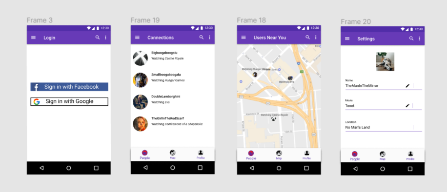
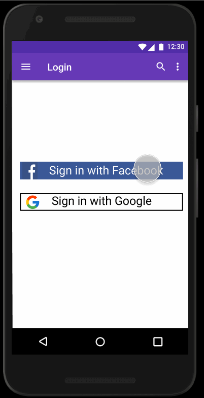

Original App Design Project - README Template
===

# TheSocialNetwork2

## Table of Contents
1. [Overview](#Overview)
1. [Product Spec](#Product-Spec)
1. [Wireframes](#Wireframes)
2. [Schema](#Schema)

## Overview
### Description
Lets users connect with other users in their close vicinity that are watching the same movies or playing the same video game. Could later be improved to connect people that are doing the same activity. 

### App Evaluation
- **Category:** Social Networking
- **Mobile:** This app would primarily be useful on mobile phones, since they are portable. It could also be viable on a computer. 
- **Story:** Collects data of user’s activities, and connects them with other users doing the same activity.
- **Market:** Any individual could use this app, and it would be especially useful in situations such as the one we are in right now with COVID.
- **Habit:** This app would be used as much as the user wants to use it. It is also dependent on the common activities that the user does, and whether or not the user wants to do this activity with other people.
- **Scope:** The purpose of this app is to connect people with similar interests. It then has the potential to grow into something as big as Twitter or Facebook, but in a different way since these users would potentially connect face to face.

## Product Spec

### 1. User Stories (Required and Optional)

**Required Must-have Stories**

* Users need to be able to login with one of google or facebook and we are able to grab personal information through google/facebook’s SDK
* Users must have location enabled in order to proceed with the app
* User will be able to see other users with n distance of them who are currently active
This is going to require google maps SDK!

* Users should be able to connect with other users
* Users should have a list of other users they’re interacted with
* User should be able to add current activity

**Optional Nice-to-have Stories**

* Users can chat with various connections. 
* Users can move through different parts of the map and are not constrained by n radius. 
* Users can filter by movie names or other kinds of activities. 

### 2. Screen Archetypes

* Login/Register
   * Users need to be able to login with one of google or facebook and we are able to grab personal information through google/facebook’s SDK
   * Users must have location enabled in order to proceed with the app

* Detail Connected User List Screen
   * Users should have a list of other users they’re interacted with

* Add current Movie
   * User should be able to add and see current movie

* Map Display Screen
   * User will be able to see other users with n distance of them who are currently active

* Profile
   * Users should be able to view account related information. 

### 3. Navigation

**Tab Navigation** (Tab to Screen)

* Map with users
* Profile
* List of connected users

**Flow Navigation** (Screen to Screen)

* Forced Log-in ->Account creation if no login is available
   * Login/Register
* Active Users Map ->Shows list of active users
   * Map Display Screen
* Profile ->Text screen to be modified
   * Profile

## Wireframes
### [BONUS] Digital Wireframes & Mockups

### [BONUS] Interactive Prototype

## Schema
### Models
**User**
| Property   	| Type             	| Description                              	|
|------------	|------------------	|------------------------------------------	|
| objectID   	| String           	| unique id for user                       	|
| username   	| String           	| name of user                             	|
| image      	| File             	| profile picture of the user              	|
| location   	| LatituteLatitute 	| current location of the user             	|
| lastActive 	| DateTime         	| last time the user was active on the map 	|

**Venture**
| Property 	| Type   	| Description                      	|
|----------	|--------	|----------------------------------	|
| objectID 	| String 	| unique id of activity            	|
| userID   	| String 	| id of user doing activty         	|
| name     	| Stirng 	| move title                       	|
| caption  	| String 	| Caption given by user            	|
| comments 	| String 	| Comments associated wth activity 	|

**Interaction**
| Property     	| Type            	| Description                            	|
|--------------	|-----------------	|----------------------------------------	|
| objectID     	| String          	| unique id of interaction               	|
| initiatorKey 	| Pointer to User 	| pointer to user initiating interaction 	|
| initiateeKey 	| Pointer to User 	| pointer to user being interacted with  	|

### Networking

 - *Map Screen*
	 - (Create/POST) a new interaction with another user
	 - (Read/GET) view other users and activities limited to an area
	 - (Optional) (Create/POST) comment on another user’s activity
 - *User Connections*
	 - (Read/GET) view interactions.
	 -  (Delete) Delete an interaction
 - *Profile*
	 - (Read/GET) Query logged in user object
	 - (Update/PUT) Update current Activity

### Existing API Endpoints
**MovieDB API**

 - Base URL: [https://www.themoviedb.org/documentation/api](https://www.themoviedb.org/documentation/api)
 
| HTTP Verb 	| Endpoint        	| Description                                      	|
|-----------	|-----------------	|--------------------------------------------------	|
| `GET`      	| /discover/movie 	| Get a list of movies based on certain sort_by id 	|

**Google Maps API**

 - Base URL
	 - [https://developers.google.com/maps/documentation](https://developers.google.com/maps/documentation)
	 - [https://developers.google.com/maps/documentation/android-sdk/location](https://developers.google.com/maps/documentation/android-sdk/location)
	 - [https://developer.android.com/training/location](https://developer.android.com/training/location)
